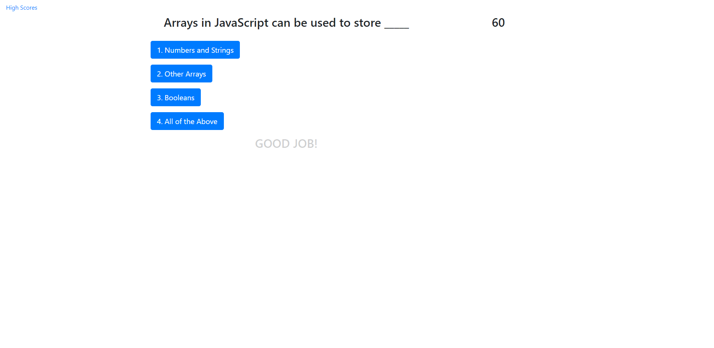

# API Code Quiz

## Description

The goal of this project was to use Web APIs and DOM manipulation to build a webpage that presents the user with a quiz about coding.  The page utilizes javascript to present the user a dynamic experience as they maneuver through the quiz.

## Installation

All functionality of this project is contained within the deployed webpage itself.  Users can navigate to the following address to experience the project:
https://pkeld148.github.io/api-code-quiz/

## Usage

When the user clicks on "Begin Quiz" they will then be presented with a series of questions with 4 possible answers.  If the user answers incorrectly 10 seconds will be deducted from the running timer.  At the end, the user's score is recorded according to how much time was left on the timer.  That score is recorded locally to the user and can be accessed by navigating to the "High Scores" link.

## Credits

MDN Web Docs was used heavily for proper usage and syntax with javascript.

## License

Licensed under the [MIT](https://github.com/Pkeld148/api-code-quiz/blob/main/LICENSE) license.